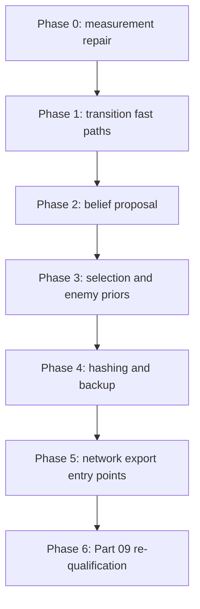

# Part 09a: Complete-turn cost reduction

## Deliverable

Reduce Morpheus complete-turn cost until a 32/64/128-particle deployment can
pass [Part 09: Online qualification](09-online-qualification.md).

The work keeps Part 09 semantics. It does not lower the minimum of 8
simulations, select a zero admission guard, or accept an 8-particle
configuration as the qualified deployment.

**Touches**

- `bots/`: belief proposal, transition fast paths, search selection, hashing,
  backup, and component timing.
- `arena/`: none required unless probe keys change.
- `scripts/` / `training/morpheus/`: component microbench and measurement
  provenance.
- `data/bot_versions/`: none.

## Prerequisites

- [Part 09: Online qualification](09-online-qualification.md) with a recorded
  `no` verdict.
- Measurement report:
  [`docs/research/measurements/morpheus-online-runtime.md`](../research/measurements/morpheus-online-runtime.md).

## Source specifications

- [Coupled online compute](../bots/morpheus/open-questions.md#coupled-online-compute)
- [Runtime](../bots/morpheus/runtime.md)
- [Belief state](../bots/morpheus/belief-state.md)
- [Search](../bots/morpheus/search.md)
- [Network inference budget](../bots/morpheus/network.md#inference-budget)

## Measured blockers

On the recorded Apple M3 Pro host:

| Particle count | Result |
| --- | --- |
| 32 / 64 / 128 | Belief plus root fails before timed search |
| 8 | Diagnostic only: mean sims ≈ 9.3, min sims = 4, normal p99 ≈ 140 ms |

Approximate 32-particle budget before this plan:

| Component | Offline p99 |
| --- | ---: |
| `belief_proposal` | ~159 ms |
| `root_inference` | ~7 ms |
| Belief plus root | ~166 ms |

Belief plus root already exceeds a 125–140 ms internal deadline. Search
optimizations cannot open the Part 09 gate until belief fits.

Dominant belief costs:

- Duplicate enemy observation, memory, and tensor construction in
  `propose_enemy_actions` / `enemy_info_tensor`.
- SHA-256 over full 49×21×21 tensors for proposal dedupe.
- Per-particle `build_tensor`, `transition`, and `emit_observation`.
- Wire `.tolist()` paths used only for internal simulation.

Dominant search costs after belief fits:

- Enemy-prior network calls hidden inside `selection`.
- Repeated `emit_observation`, `update_memory`, and digests in
  `select_path`.
- `backup_node` rescans every reservoir particle for enemy weights.
- Leaf tensor construction and host sync around batched forwards.

## Goal

Qualify at least one joint configuration with:

- particle count in {32, 64, 128};
- at least 8 completed simulations on every warm nonterminal move;
- belief plus root complete on every move;
- normal p99 inside the selected internal deadline;
- a positive admission guard;
- peak RSS below 2 GB;
- zero submission-harness faults.

The 8-particle configuration remains diagnostic only.

## Phase order

Belief work comes first. Search work starts only after a 32-particle belief
plus root forecast fits the internal deadline with margin for eight
simulations and a positive guard.



### Phase 0: Repair performance evidence

1. Split timing in `bots/morpheus/runtime.py`:
   - charge propose, filter, and transition separately;
   - record hashing and reply as elapsed cost, not forecasts;
   - move enemy-prior inference out of the `selection` timer;
   - ensure `enemy_prior_batch` never writes `NaN`.
2. Add forward-call counters by consumer: belief proposal, root, enemy prior,
   leaf batch.
3. Make the benchmark reproducible:
   - record sweep-config digest and commit hash;
   - write strict JSON without `NaN`;
   - restore or re-run the exact sweep config used for the report;
   - cover board sizes and turn bands from recorded states.

**Gate:** Component sums explain complete-turn time. No network call appears
under `selection`. Offline component values are finite.

### Phase 1: Transition fast paths

1. Add a non-build fast path in `bots/morpheus/transition.py` so pass and move
   turns do not build two castle-cost grids.
2. Add a pre-deathtouch fast path that calls `step_base` before turn 800.
3. Reuse legal masks and build-cost grids across expand and mandatory-candidate
   helpers.
4. Keep differential tests against the competition transition.

**Gate:** Transition parity tests pass. Selection and particle-transition p99
decrease on the same fixtures.

### Phase 2: Belief proposal

This phase is the critical path for 32-particle qualification.

1. Remove duplicate observation and memory construction.
   - Build enemy observation and memory once in `propose_enemy_actions`.
   - Pass those objects into tensor construction.
2. Deduplicate before tensor construction.
   - Key on enemy observation, enemy memory, and previous enemy action.
   - Build one tensor and one legal mask per unique key.
3. Prefer array-based internal observations for belief and search loops.
   - Avoid wire `.tolist()` on the hot path.
   - Keep the protocol `Observation` shape unchanged for stdio.
4. Benchmark proposal batches 4, 8, 16, 32, and 64.
5. Keep sampling order and probability semantics unchanged.
6. Add exact tests for:
   - dedupe mapping;
   - policy logits;
   - legal masks;
   - fixed-seed sampled actions;
   - belief survival and ESS.

**Gate:** 32-particle belief plus root fits the internal deadline and leaves
measured time for eight simulations plus a positive admission guard.

Do not:

- reduce particle count to pass the gate;
- approximate `observations_match`;
- share one enemy action across particles;
- raise `max_proposal_batch` without remeasurement.

### Phase 3: Selection and enemy priors

Start this phase only after Phase 2 passes.

1. Change `select_path` so an unexpanded node stops for leaf evaluation.
   Selection must not call the network.
2. Stage missing enemy-table priors:
   - select until a prior is missing;
   - batch enemy-prior tensors;
   - resume selection;
   - batch leaf evaluations separately.
3. Record enemy-prior and leaf timing under their own components.
4. Preserve frozen-batch semantics and the partial-simulation rule.

**Gate:** A test evaluator proves that selection performs zero network calls.

### Phase 4: Hashing and backup

1. Reuse observation, memory, and digests within one search depth step.
2. Add a prehashed information-state key helper so callers do not re-digest
   memory.
3. Cache enemy-information weights by reservoir version.
   - `backup_node` must not rebuild every particle observation on every edge.
4. Avoid full 3970-entry prior arrays when widening is frozen.
5. Sort only legal candidate indices.

**Gate:** Fixed-seed root statistics and actions match the pre-change
implementation after the same completed simulations.

### Phase 5: Network export entry points

1. Export dedicated online entry points:
   - policy-only for belief and enemy priors;
   - policy plus WDL for root and leaves.
2. Do not compute auxiliary heads during online search.
3. Test qnnpack locally.
4. Test fbgemm and x86 artifacts on pinned Linux cores.

**Gate:** Exported policy logits and WDL values pass existing parity
tolerances.

### Phase 6: Part 09 re-qualification

Run gates in this order:

1. 32 particles, 8 simulations, targeted component benchmark.
2. All board sizes and turn bands.
3. Scheduler-variation test with a positive admission guard.
4. Full 32/64/128-particle sweep.
5. Competition match against `bots/smoke/run.sh`.
6. Extracted-bundle submission harness.

Answer `yes` only under the Part 09 exit criterion. Do not lower the
8-simulation minimum, select a zero guard, or promote an 8-particle
configuration.

## First implementation increment

1. Phase 0 measurement corrections.
2. Phase 1 transition fast paths.
3. Phase 2 belief-proposal duplication removal and pre-tensor dedupe.

Stop after those three items and remeasure 32-particle belief plus root before
any search refactor.

## Isolated tests

```bash
python -m pytest \
  bots/morpheus/tests/test_belief_filter.py \
  bots/morpheus/tests/test_transition_kernel.py \
  bots/morpheus/tests/test_runtime_controller.py \
  bots/morpheus/tests/test_deadline_degradation.py \
  -m morpheus -q
```

```bash
python scripts/morpheus_measure.py online-runtime \
  --config scripts/configs/morpheus/online-sweep-smoke.json \
  --single-core \
  --dry-run \
  --output docs/research/measurements/morpheus-complete-turn-cost.json
```

After Phase 2 passes, re-run the Part 09 isolated tests from
[09-online-qualification.md](09-online-qualification.md).

## Exit criterion

Answer `yes` when a 32-particle or larger configuration passes Part 09,
including the submission harness.

Answer `no` if belief plus root still cannot fit, any warm normal move misses
8 simulations, an estimator field remains undefined, or the submission harness
rejects the bundle.
