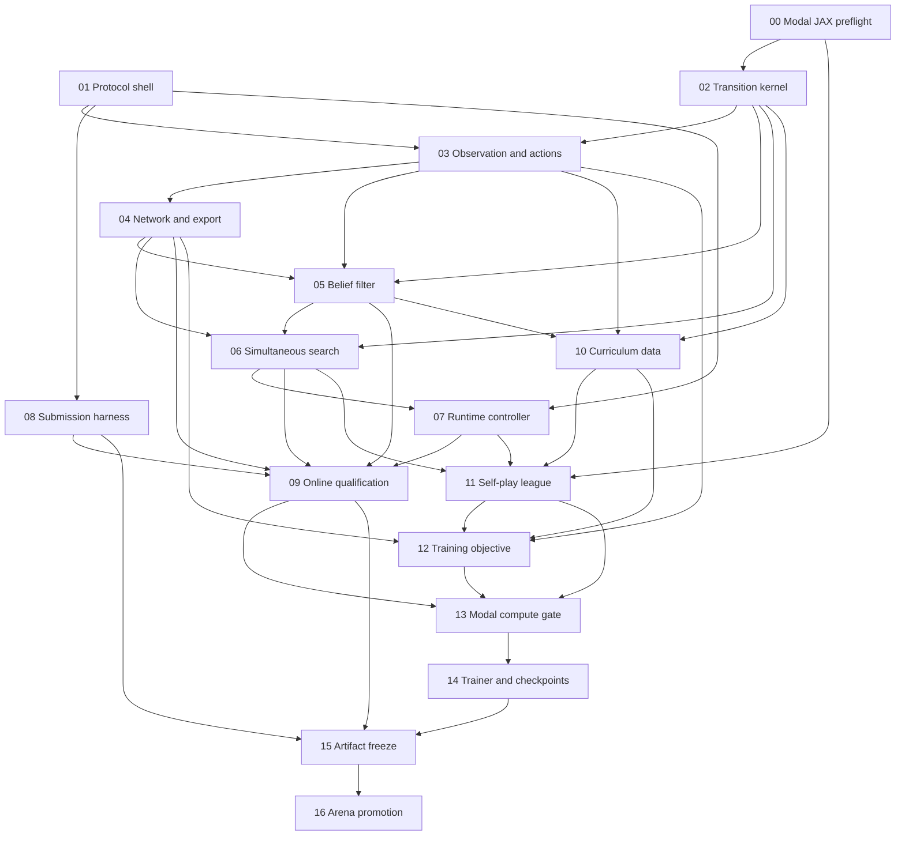

# Morpheus implementation

This directory is the implementation plan for the
[Morpheus design](../bots/morpheus/index.md). The design files remain the source
of truth. This directory owns order, dependencies, tests, and exit criteria.

The plan uses the competition rules in [RULES.md](../../RULES.md) and the
repository process in [AGENTS.md](../../AGENTS.md). It does not use
`docs/bots/morpheus/spec-review.md`.

## Phase order

### Phase 0: retire external risk

1. [Modal JAX preflight](00-modal-jax-preflight.md) tests the A100 JAX path.
2. [Protocol shell](01-protocol-shell.md) creates the first runnable stub.
3. [Submission harness](08-submission-harness.md) proves that judge failures
   are detected.

Part 01 is the earliest point at which a degraded Morpheus can pass the
competition gate. The stub is not a trained Morpheus, is not eligible for
promotion, and must not enter a rating decision.

### Phase 1: deployable decision stack

1. [Transition kernel](02-transition-kernel.md)
2. [Observation and actions](03-observation-actions.md)
3. [Network and export](04-network-export.md)
4. [Belief filter](05-belief-filter.md)
5. [Simultaneous search](06-simultaneous-search.md)
6. [Runtime controller](07-runtime-controller.md)
7. [Online qualification](09-online-qualification.md)

### Phase 2: training inputs and self-play

1. [Curriculum data](10-curriculum-data.md)
2. [Self-play league](11-self-play-league.md)
3. [Training objective](12-training-objective.md)

### Phase 3: compute decision

1. [Modal compute gate](13-modal-compute-gate.md)

Parts 00 and 13 can use only bounded qualification time. The main training run
cannot start until Part 13 returns `yes`.

### Phase 4: train and promote

1. [Trainer and checkpoints](14-trainer-checkpoints.md)
2. [Artifact freeze](15-artifact-freeze.md)
3. [Arena promotion](16-arena-promotion.md)

## Dependency graph



## Gates

Every part that leaves `bots/morpheus/run.sh` runnable must finish this match:

```bash
python competition-module/competition/matchup.py \
  bots/morpheus/run.sh bots/smoke/run.sh \
  --mode competition --seed 0
```

The match must end by a win, loss, draw, or turn-1200 truncation.

Promotion also requires all of these results:

- Part 08 rejects every controlled judge failure.
- Part 09 accepts one deployment configuration with zero faults.
- Part 13 proves that the training schedule fits the compute budget.
- Part 15 accepts the exact frozen bundle.
- Part 16 reports the pairwise contrast required by
  [the decision rule](../arena/decision-rule.md).

## Test placement

Fast pure tests can enter the normal suite. Morpheus model, JAX, real-match,
Modal, and subprocess tests use an explicit `morpheus` gate:

```bash
python -m pytest -m morpheus -q
```

The normal warm suite must remain below the 7-second limit in
[AGENTS.md](../../AGENTS.md).

## Code boundary

The planned runtime closure is `bots/morpheus/`. Thin operator entry points are
under `scripts/`. The submission harness is under `arena/`.

`AGENTS.md` does not define a location for training-only modules. The proposed
location is `training/morpheus/`. Implementation must add that placement rule
before training code lands.
