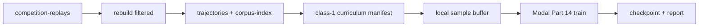

# Scraped class-1 rebuild for Part 14 training

Rebuild 50 ResBot true wins and 50 erik.bystron true losses into trajectories,
build a class-1-only curriculum with explicit sample seats, then materialize
seat samples into a local replay buffer for Modal Part 14 training.

## Defaults (locked for this slice)

- **ResBot:** 50 games where `Replay.outcome == "win"` for queried player
  `ResBot` (not the scraper `win/` folder alone).
- **erik.bystron:** 50 games where `Replay.outcome == "lose"` for queried
  player `erik.bystron`.
- **Sample seats:** ResBot items train from ResBot’s seat; erik items train
  from erik’s seat (so the 50+50 mix is wins + losses for the confidence
  count).
- **Training:** Part 14 trainer reads a pre-built `*.sample.npz` buffer. Do
  not reconstruct prefixes on the Modal GPU host.

## Data flow



## 1. Outcome-filtered rebuild

```bash
python scripts/morpheus_rebuild_scraped.py \
  --player ResBot \
  --outcome win --keep 50 \
  --output data/trajectories/pilot-class1-resbot-wins \
  --report docs/research/measurements/morpheus-pilot-resbot-wins-rebuild.json

python scripts/morpheus_rebuild_scraped.py \
  --player erik.bystron \
  --outcome lose --keep 50 \
  --output data/trajectories/pilot-class1-erik-losses \
  --report docs/research/measurements/morpheus-pilot-erik-losses-rebuild.json
```

Source labels stay `ResBot_reconstructions` and `erik.bystron_reconstructions`.
Raw `ResBot` stays banned.

## 2. Class-1 curriculum

Build options: `--classes 1`, `--full-start-count 0`, multi-root trajectories,
and sample-seat resolution from corpus-index player names.

Write manifest to `training/morpheus/manifests/pilot-class1-scraped.json`
(committed path: manifest only; trajectories stay derived/gitignored).

Verify: no banned raw ResBot labels; every item `class_id==1`; `decisive`;
`sample_seat` set; both source tags present.

## 3. Local materialize → Modal train

1. Reconstruct class-1 items locally with
   `training.morpheus.trainer.sample.build_train_sample`.
2. Write `*.sample.npz` under `data/morpheus/trainer/buffer/` via
   `training.morpheus.trainer.buffer.write_sample`.
3. Upload that buffer directory to Modal Volume `/vol/morpheus/buffer`.
4. Run Part 14:

```bash
modal run scripts/morpheus_modal.py::train \
  --config training/morpheus/configs/promotable-run.json
```

Use the provisional objective freeze in
`training/morpheus/configs/pilot-objective.json` until Part 12/13 replace it.

## 4. Tests

- Rebuild filter: outcome uses `replay.outcome`; `--keep` stops at kept count.
- Curriculum: `ResBot_reconstructions` accepted; raw `ResBot` rejected;
  class-1-only manifest; `sample_seat` round-trips.
- Part 14 trainer: overfit + interrupt/resume under `-m morpheus`.

## 5. Operator sequence

1. Rebuild ResBot wins + erik losses.
2. Build + verify class-1 manifest.
3. Materialize buffer locally; upload to the Modal volume.
4. `modal run scripts/morpheus_modal.py::train --config ...`
