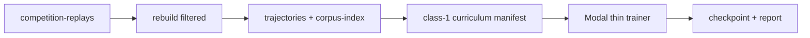

# Scraped class-1 rebuild and Modal learning smoke

Rebuild 50 ResBot true wins and 50 erik.bystron true losses into trajectories,
build a class-1-only curriculum with explicit sample seats, then run a thin
Modal learning-pipeline smoke (train steps + checkpoint) using the provisional
pilot objective.

## Defaults (locked for this slice)

- **ResBot:** 50 games where `Replay.outcome == "win"` for queried player
  `ResBot` (not the scraper `win/` folder alone).
- **erik.bystron:** 50 games where `Replay.outcome == "lose"` for queried
  player `erik.bystron`.
- **Sample seats:** ResBot items train from ResBot’s seat; erik items train
  from erik’s seat (so the 50+50 mix is wins + losses for the confidence
  count).
- **Learning test:** thin pilot trainer on Modal (forward + backward steps, 1
  checkpoint, loss report). Not full Part 14.

## Data flow



## 1. Outcome-filtered rebuild

Extend `training/morpheus/scraped_rebuild/rebuild.py` and
`scripts/morpheus_rebuild_scraped.py`:

- Add `--outcome {win,lose,draw,all}` filtered by `replay.outcome`
  (queried-player result from `arena/instrument/replay/loader.py`), never by
  folder name.
- Add `--keep N`: continue scanning until `N` trajectories are **kept**
  (verify-ok), not until `N` files are scanned (unresolved ticks are common).
- Keep existing source labels: `ResBot_reconstructions`,
  `erik.bystron_reconstructions` via `source_label_for` (raw `ResBot` stays
  banned).

Commands (local):

```bash
python scripts/morpheus_rebuild_scraped.py \
  --player ResBot \
  --outcome win --keep 50 \
  --output data/trajectories/pilot-class1-resbot-wins \
  --report docs/research/measurements/morpheus-pilot-resbot-wins-rebuild.json

python scripts/morpheus_rebuild_scraped.py \
  --player erik.bystron \
  --outcome lose --keep 50 \
  --output data/trajectories/pilot-class1-erik-losses \
  --report docs/research/measurements/morpheus-pilot-erik-losses-rebuild.json
```

Inventory is enough locally (ResBot wins ≈1454, erik losses ≈371). Expect
kept less than scanned if some ticks fail inference.

## 2. Class-1 curriculum from those trajectories

Extend curriculum build so this pilot does not require the heuristic panel as
the data source:

- Add `sample_seat` (0/1) on `CurriculumItem` (optional for old manifests;
  required for this pilot).
- Add build options: `--classes 1`, `--full-start-count 0`, multi-root
  trajectories or a merged dir, and sample-seat resolution from corpus-index
  player names.
- New thin panel/config stub for provenance only, e.g.
  `scripts/configs/morpheus/pilot-class1-scraped.json`, with `source_label` not
  banned.
- Classifier already defines class 1; `sample_prefixes_for_build` keeps up to 2
  class-1 prefixes per decisive game.
- Write manifest to `training/morpheus/manifests/pilot-class1-scraped.json`
  (committed path: manifest only; trajectories stay derived/gitignored).
- Verify: no banned raw ResBot labels; every item `class_id==1`; `decisive`;
  `sample_seat` set; both source tags present.

WDL expectation for the pilot pool: ResBot-seat wins + erik-seat losses →
mixed outcomes for class 1 (confidence floor is 32 mixed samples; this pool
overshoots).

## 3. Thin learning pipeline (Modal)

There is no Part 14 trainer yet. Add a **pilot-only** path under
`training/morpheus/pilot/` (training-only; not in bot closure):

- Load `training/morpheus/configs/pilot-objective.json` via
  `load_pilot_objective_bundle`.
- For a small batch of class-1 items: `reconstruct_prefix` → build seat targets
  for `sample_seat` → apply objective losses → AdamW step on the float Morpheus
  net (`training/morpheus/network.py` / bot model contract).
- Cap: e.g. 50–200 steps, batch size small, timeout bounded; write one
  checkpoint + JSON loss report under Modal Volume `/vol/morpheus/pilot/...`
  and mirror summary to
  `docs/research/measurements/morpheus-pilot-class1-learn.{json,md}`.
- Wire `scripts/morpheus_modal.py::pilot_learn` (A100) charging wall time into
  Part 13 accounting notes (not a Part 13 `yes`).

Success criteria for this smoke (not arena promotion):

- rebuild keeps ≈50+50
- class-1 manifest verifies
- Modal run finishes without fault
- loss finite and decreases vs step 0 on the pilot batch
- checkpoint reloadable

Explicit non-goals: pairwise `improvement`, belief-calibration gate, Part 13
`yes`, full self-play league loop.

## 4. Tests

- Rebuild filter: outcome uses `replay.outcome`; `--keep` stops at kept count.
- Curriculum: `ResBot_reconstructions` accepted; raw `ResBot` rejected;
  class-1-only manifest; `sample_seat` round-trips.
- Pilot step: one fake item / tiny checkpoint overfits or at least runs one
  backward pass (mark `morpheus`).

## 5. Operator sequence

1. Rebuild ResBot wins + erik losses.
2. Build + verify class-1 manifest.
3. `modal run scripts/morpheus_modal.py::pilot_learn --config ...`
4. Read measurement report; stop or iterate.

## Implementation todos

1. Add `--outcome` and `--keep` to scraped rebuild CLI/API; run 50 ResBot wins
   + 50 erik losses.
2. Add `sample_seat` + class-1-only curriculum build; write
   `pilot-class1-scraped` manifest.
3. Implement `training/morpheus/pilot/` reconstruct → loss → step → checkpoint.
4. Add `morpheus_modal.py::pilot_learn` and measurement report.
5. Add morpheus-marked tests for rebuild filter, class-1 manifest, pilot step.
